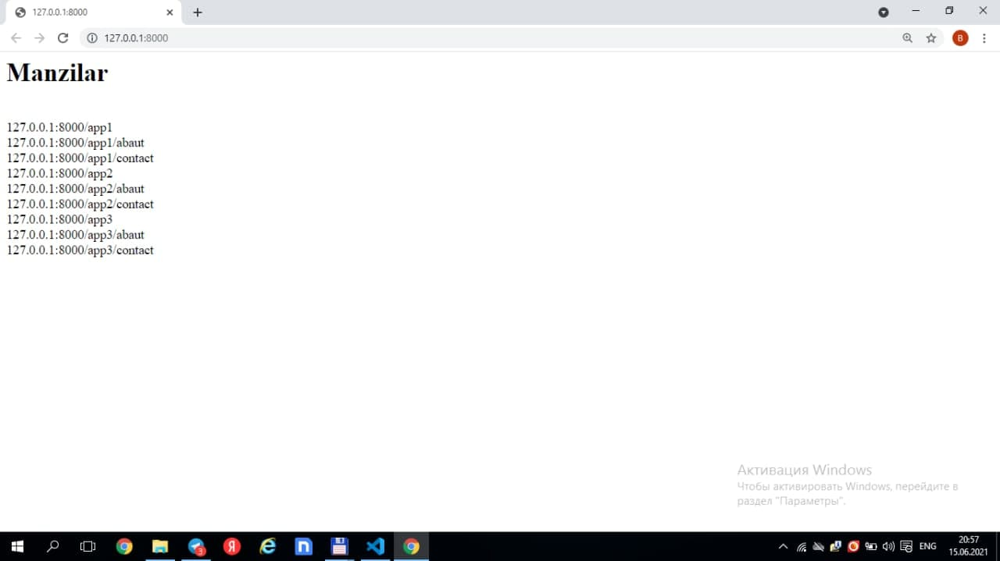
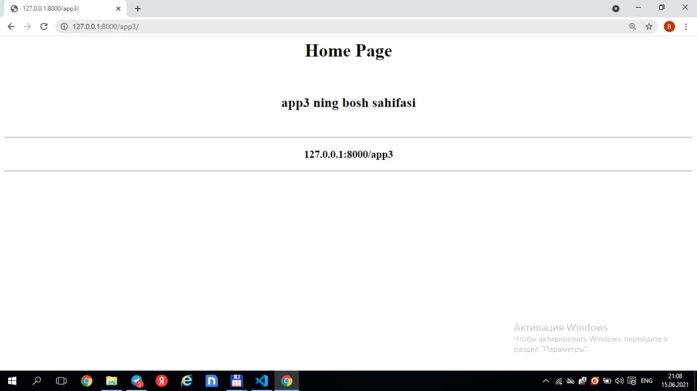

# Django-urls
***
### 1.vertual muhit yaratib olamiz 
    1.1 python -m venv env
    1.2 env\Scsripts\activate
### 2.djangoni o'rnatib olamiz
    2.1 pip install django
### 3.djangoda proyekt yaratib olamiz
    3.1 django-admin startproject config .
### 4.djangoda app ni yaratib olamiz
    4.1 python manage.py startapp app
      

### 4.djangoda app1 ni yaratib olamiz
    4.1 python manage.py startapp app1    

### 4.djangoda app2 ni yaratib olamiz
    4.1 python manage.py startapp app2

### 4.djangoda app3 ni yaratib olamiz
    4.1 python manage.py startapp app3    
  

